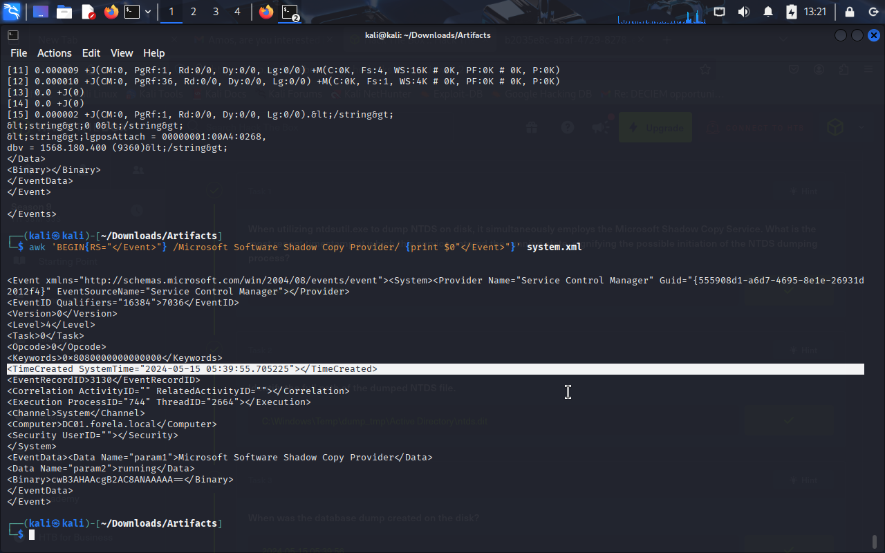
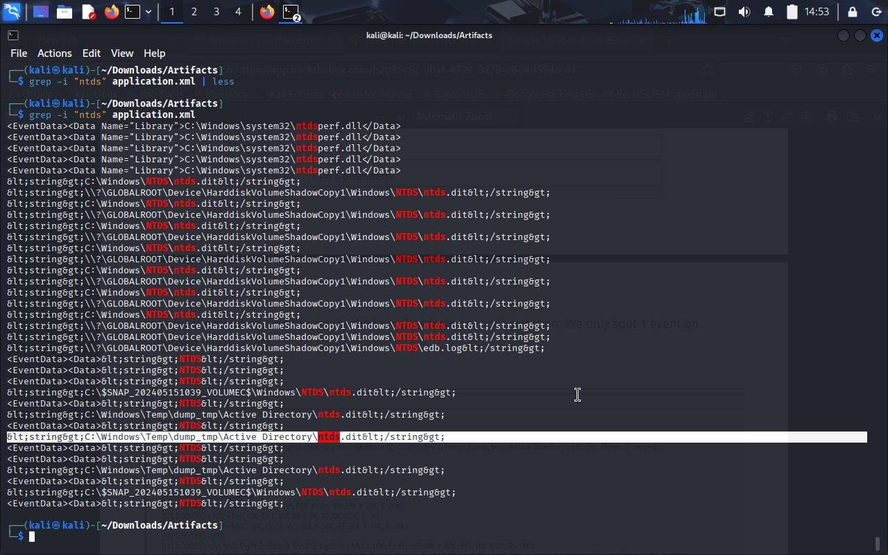
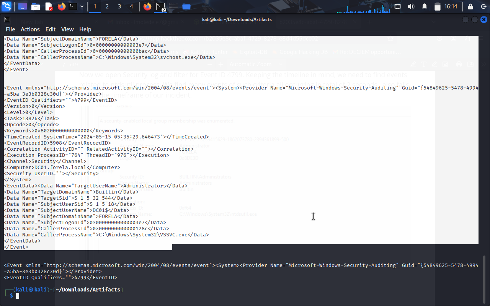

# DFIR Case Study — NTDS.dit Dump via ntdsutil.exe

*Scenario:*  
Forela’s Domain Controller (DC01) raised an alert of a suspicious NTDS.dit exfiltration attempt.  
Just one day before, the same attacker dumped NTDS.dit using the vssadmin utility.  
Although remediation was performed, the attacker maintained persistence and returned,  
this time abusing ntdsutil.exe with shadow copies to dump the Active Directory database.  

As the Incident Responder, I was tasked with analyzing *System, Security, and Application event logs*  
to reconstruct the attacker’s activities and timeline.  

---

## Objectives
- Identify when *Microsoft Shadow Copy Service* was started.  
- Locate the *dumped NTDS.dit path* on disk.  
- Find the *timestamp of database dump creation*.  
- Determine which *event source (provider)* logged database actions.  
- Identify which *user groups were enumerated* by the attacker.  
- Correlate the *logon session time* for the malicious account.  

---

## Tools & Artifacts
- *Artifacts:* system.xml, application.xml, security.xml  
- *Tools Used:* grep, awk, sed, manual log analysis on Kali Linux  
- *Format:* Markdown write-up with screenshots of analysis  

---

## My Analysis Process

1. Extracted *event IDs* from system.xml, application.xml, and security.xml.  
2. Filtered logs with grep and awk to locate suspicious entries.  
3. Identified the *Shadow Copy Provider service* starting, linked to ntdsutil.  
4. Found the *NTDS.dit dump path* in C:\Windows\Temp\dump_tmp\Active Directory\.  
5. Correlated *timestamps* between service start, file creation, and user logon.  
6. Determined attacker enumerated *Administrators* and *Backup Operators* groups.  
7. Mapped the malicious *logon session time* via Logon ID.  

---

## Q1 — Microsoft Shadow Copy Service
*Question:*
When utilizing ntdsutil.exe to dump NTDS on disk, it simultaneously employs the Microsoft Shadow Copy Service. 
What is the most recent timestamp at which this service entered the running state, signifying the possible initiation of the NTDS dumping process?

*Answer:* 
2024-05-15 05:39:55

*Command run:*
```bash

awk 'BEGIN{RS="</Event>"} /Microsoft Software Shadow Copy Provider/ {print $0"</Event>"}' system.xml
```


## Q2 — dumped NTDS file
*Question:*
Identify the full path of the dumped NTDS file.
 *Answer:*  
C:\Windows\Temp\dump_tmp\Active Directory\ntds.dit
*Command run:*
```bash
grep -i "ntds" application.xml
```


## Q3 — database dump created 
*Question:*
When was the database dump created on the disk?
*Answer:* 
<TimeCreated SystemTime="2024-05-15 05:39:58.549019"></TimeCreated>
*Command run:*
```bash
awk 'BEGIN{RS="</Event>"} /Temp/ {print $0"</Event>"}' application.xml
```
/ {print $0"</Event>"}' security.xml > evx4799.xml 
sed -n '1,200p' evx4799.xml
```



## Q6 — Malicious logon session
*Question:*
Now you are tasked to find the Login Time for the malicious Session. Using the Logon ID, find the Time when the user logon session started.
*Answer:*
<TimeCreated SystemTime="2024-05-15 05:36:31.402386"></TimeCreated>
*Command run:*
```bash
grep -i "EventID" security.xml | head -20  
awk 'BEGIN{RS="</Event>"} /<EventID[^>]*>(4698)/ {print $0"</Event>"}' security.xml > evx4698.xml  
cat evx4698.xml
```


